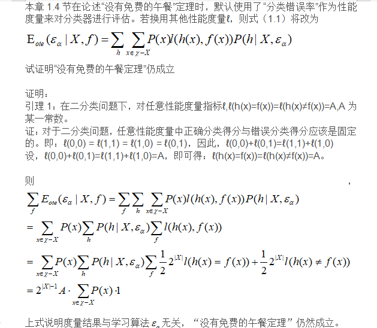

##### 1.1表中若只包含编号为1和4的两个样例，试给出相应的版本空间

>编号|色泽|根蒂|敲声|好瓜
> :---: | :---: | :---: | :---: | :---:
>1|青绿|蜷缩|浊响|是
>4|乌黑|稍蜷|沉闷|否
> 
> 版本空间：与训练数据集一致的假设集合
> 
> 上表中的假设集合为：
> 
> 编号|色泽|根蒂|敲声
> :---: | :---: | :---: | :---:
> 1|*|*|*
> 2|*|*|浊响
> 3|*|*|沉闷
> 4|*|蜷缩|*
> 5|*|稍蜷|*
> 6|青绿|*|*
> 7|乌黑|*|*
> 8|青绿|蜷缩|*
> 9|青绿|稍蜷|*
> 10|乌黑|蜷缩|*
> 11|乌黑|稍蜷|*
> 12|*|蜷缩|浊响
> 13|*|蜷缩|沉闷
> 14|*|稍蜷|浊响
> 15|*|稍蜷|沉闷
> 16|青绿|*|浊响
> 17|青绿|*|沉闷
> 18|乌黑|*|浊响
> 19|乌黑|*|沉闷
> 20|青绿|蜷缩|浊响
> 21|青绿|蜷缩|沉闷
> 22|青绿|稍蜷|浊响
> 23|青绿|稍蜷|沉闷
> 24|乌黑|蜷缩|浊响
> 25|乌黑|蜷缩|沉闷
> 26|乌黑|稍蜷|浊响
> 27|乌黑|稍蜷|沉闷
> 28|空集
> 
> 删除与样例1不一致的假设：3,5,7,9,10,11,13,14,15,17,18,19,21-28
> 
> 删除与样例4一致的假设：1
> 
> 剩余：2,4,6,8,12,16,20，所以版本空间为：
> 
> 编号|色泽|根蒂|敲声
> :---: | :---: | :---: | :---:
> 2|*|*|浊响
> 4|*|蜷缩|*
> 6|青绿|*|*
> 8|青绿|蜷缩|*
> 12|*|蜷缩|浊响
> 16|青绿|*|浊响
> 20|青绿|蜷缩|浊响
##### 1.2与使用单个合取式来进行假设表示相比，使用“析合范式”将使得假设空间具有更强的表示能力。若使用最多包含k个合取式的析合范式来表达表1.1西瓜分类问题的假设空间，试估算有多少种可能的假设
> 答案：
> 
>编号|色泽|根蒂|敲声|好瓜
> :---: | :---: | :---: | :---: | :---:
>1|青绿|蜷缩|浊响|是
>2|乌黑|蜷缩|浊响|是
>3|青绿|硬挺|清脆|否
>4|乌黑|稍蜷|沉闷|否
>
>由上表可知：存在2*3*3=18种基础假设。（未完待续）
##### 1.3若数据包含噪声，则假设空间中有可能不存在与所有训练样本都一致的假设。在此情形下，设计一种归纳偏好用于假设选择。
>答：
> 噪音相对于整个训练样本来说所占比例比较小，所以只需要选择与大部分训练样本一致的假设。
##### 1.4 

##### 1.5试述机器学习能在互联网搜索的哪些环节起作用
>1.在向搜索引擎提交信息的阶段，能够从提交文本中进行信息提取，进行语义分析。
>
>2.在搜索引擎进行信息匹配的阶段，能够提高问题与各个信息的匹配程度。
>
>3.在向用户展示搜索结果的阶段，能够根据用户对结果感兴趣的程度进行排序。